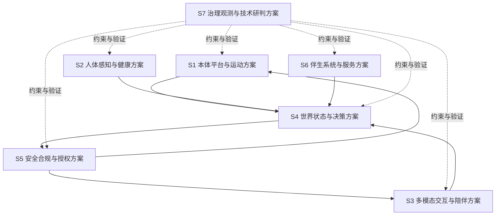

# Kinbot_OODA 总体方案与模块方案下发基线

## 1. 文档目的

本文档承接 [docs/PDCP_SYSTEM_ARCHITECTURE_REVIEW_PACKAGE.md](docs/PDCP_SYSTEM_ARCHITECTURE_REVIEW_PACKAGE.md)。

其作用不是重复系统架构，而是把系统架构进一步转成“各模块可以开工设计”的总体方案下发基线。

## 2. 当前阶段定位

当前阶段定位为：

1. 产品需求已基本冻结
2. 系统架构已形成完整 `PDCP` 评审包
3. 当前要做的是总体方案下发，而不是进入量产发布准备

因此，本文件的核心任务是：

1. 明确模块设计的输入边界
2. 明确模块设计必须提交的产物
3. 明确模块间接口冻结顺序
4. 明确技术研判与模块方案的关系

## 3. 当前已冻结的系统架构输入

`KBT-32` 不是重新发明系统架构，而是承接已经通过 `PDCP` 评审的系统输入。当前必须显式继承以下约束：

1. 双视角总体架构基线已经成立：本体 `6` 个实体域 + 运行时 `9` 个一级模块
2. 双视角一致性检查机制已进入系统架构基线
3. `Body Capability Contract + 接口稳定性策略` 已进入一级接口与治理基线
4. `D1 / D6 / D7` 是后续总体方案与模块设计必须显式应对的三项一级阻断输入
5. `KBT-33` 将承接双视角一致性与接口稳定性策略的治理细化，但不回退重定义系统边界

## 4. 总体方案结构

建议把当前总体方案收敛为 `7` 个工作包：

## 5. 七个工作包定义

### 4.1 `S1` 本体平台与运动方案

覆盖模块：

- `platform_runtime`
- `mobility_navigation`

当前任务：

1. 端侧计算平台总体布局
2. 底盘、执行器、定位与运动安全总体方案
3. 传感器布局与本体资源预算

### 4.2 `S2` 人体感知与健康方案

覆盖模块：

- `human_health_sensing`

当前任务：

1. 身份、姿态、生命体征、异常候选事件总体方案
2. 穿戴与蓝牙外设接入总体方案
3. 睡眠监测与健康事件补采总体方案

### 4.3 `S3` 多模态交互与陪伴方案

覆盖模块：

- `multimodal_interaction`

当前任务：

1. 语音、屏幕、灯光与远程交互协同方案
2. 人设、主动交互、长期记忆治理总体方案
3. 找人、找物、到人等交互触发场景方案

### 4.4 `S4` 世界状态与决策方案

覆盖模块：

- `world_state_memory`
- `decision_orchestration`

当前任务：

1. 世界状态统一模型与状态同步方案
2. 分层状态机、行为树与任务编排方案
3. 多尺度 `OODA` 与 `OODA Scale Scheduler` 落地方案

### 4.5 `S5` 安全合规与授权方案

覆盖模块：

- `safety_compliance_authorization`

当前任务：

1. 高风险动作审批与仲裁方案
2. 安全事件、降级与故障保护方案
3. 权限、隐私、审计和合规约束方案

### 4.6 `S6` 伴生系统与服务方案

覆盖模块：

- `companion_service_system`

当前任务：

1. 家属 App、云服务、后台人工服务的最小闭环总体方案
2. 第三方平台、互联网医院、配送与外部生态接入方案
3. 远程确认、事件升级与服务结果回写方案

### 4.7 `S7` 治理观测与技术研判方案

覆盖模块：

- `observability_data_governance`
- 技术研判输入包

当前任务：

1. 日志、指标、审计和问题归因总体方案
2. 数据治理、隐私治理和高端产品感检查机制
3. 技术路线评估如何作为模块方案的约束输入，而不是反向改写系统边界

## 6. 模块必须提交的 `7` 类产物

各模块后续进入自己的架构与总体方案设计时，至少提交以下 `7` 类产物：

1. 模块职责与边界说明
2. 模块架构图与内部二级分层
3. 对外接口清单与接口草案
4. 关键状态模型 / 数据模型
5. 关键技术路线与备选方案
6. 风险清单、约束和依赖项
7. 验证方案与阶段门检查项

## 7. 模块方案评审顺序

为避免接口漂移，建议模块方案按以下顺序评审：

1. `S4 世界状态与决策方案`
2. `S5 安全合规与授权方案`
3. `S1 本体平台与运动方案`
4. `S2 人体感知与健康方案`
5. `S3 多模态交互与陪伴方案`
6. `S6 伴生系统与服务方案`
7. `S7 治理观测与技术研判方案`

说明：

- `S4` 与 `S5` 优先，是因为它们定义状态面和动作门。
- `S7` 虽然最后评审，但它贯穿全过程，持续作为约束输入。

## 8. 技术研判与模块方案的关系

当前技术研判不应越位替代模块方案，但应作为输入约束存在：

1. `VLN`、多相机纯视觉、端侧算力路线等，作为 `S1 / S2 / S3 / S4` 的输入
2. 穿戴兼容、`UWB` 观察线、成本与功耗约束，作为 `S2 / S6 / S7` 的输入
3. `D1 / D6 / D7` 三项一级阻断输入，作为 `S1 / S2 / S4 / S6 / S7` 的共同输入
4. `KBT-33` 中的接口治理要求，作为 `S4 / S5 / S7` 的治理输入
5. 量产预备、`MVP`、发布与交付等后置文档，只作为远期约束，不反向抢占当前主线

## 9. 模块设计启动条件

模块可以正式启动内部架构与总体方案设计的条件建议收敛为：

1. `PDCP` 系统架构评审通过
2. 当前一级模块边界不再漂移
3. 世界状态、决策状态机和安全门已形成稳定基线
4. 模块上游 / 下游接口面有明确责任人
5. 模块已拿到对应的技术研判输入包

## 10. 当前下发建议

当前建议立即启动以下动作：

1. 用本文件把模块工作包和评审顺序同步到 Linear
2. 由各模块 owner 认领 `S1-S7` 工作包
3. 先启动 `S4 / S5`，再并行推进 `S1 / S2 / S3 / S6 / S7`
4. 各模块第一轮先交“模块架构 + 接口草案”，不要一开始就陷入实现细节
5. `S1 / S4 / S6 / S7` 第一轮必须显式回答 `D1 / D6 / D7` 三项阻断输入如何落到本工作包

## 11. 本轮评审结论入口

本文件建议重点评审以下 `5` 点：

1. 是否接受 `S1-S7` 这 `7` 个总体方案工作包。
2. 是否接受“每个模块必须提交 `7` 类产物”的下发要求。
3. 是否接受当前模块方案评审顺序，尤其是 `S4 / S5` 优先。
4. 是否接受“技术研判是输入约束，不反向重写系统边界”这一原则。
5. 是否接受 `PDCP` 通过后，模块先交“模块架构 + 接口草案”，再进入更细总体方案。
