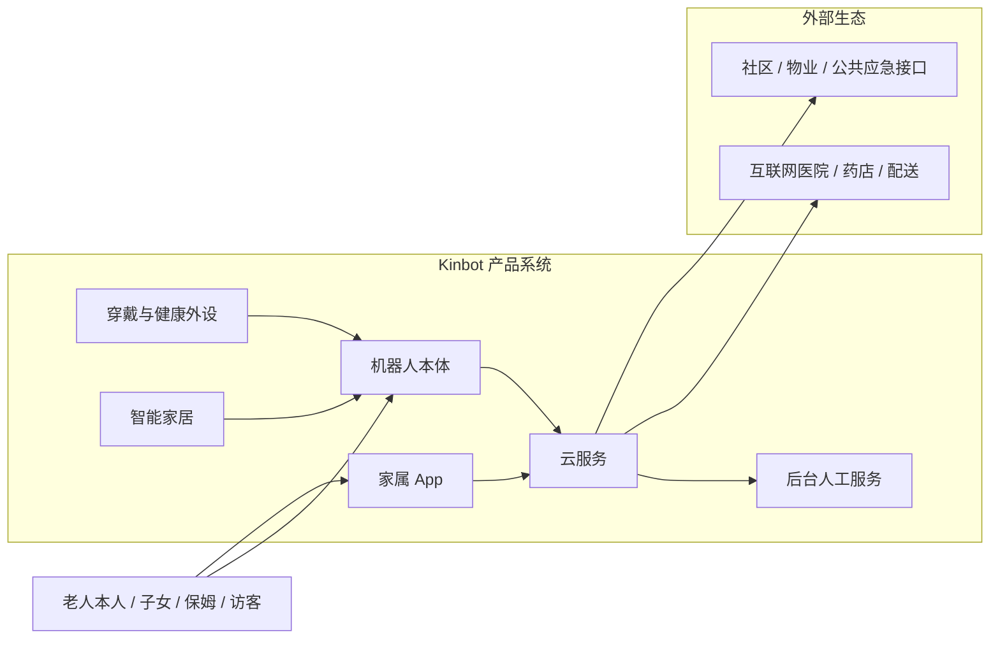
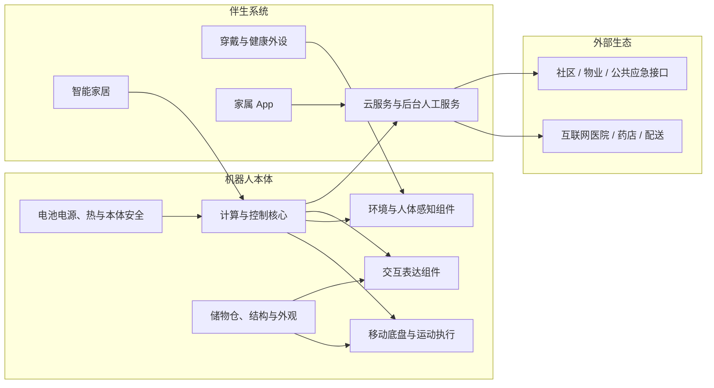
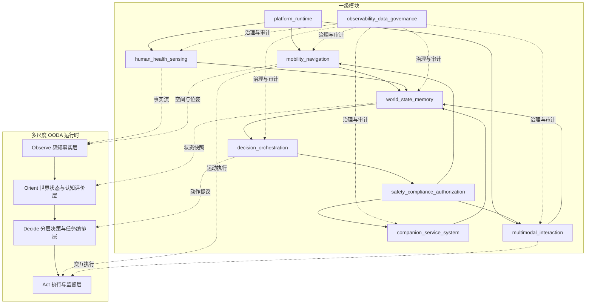
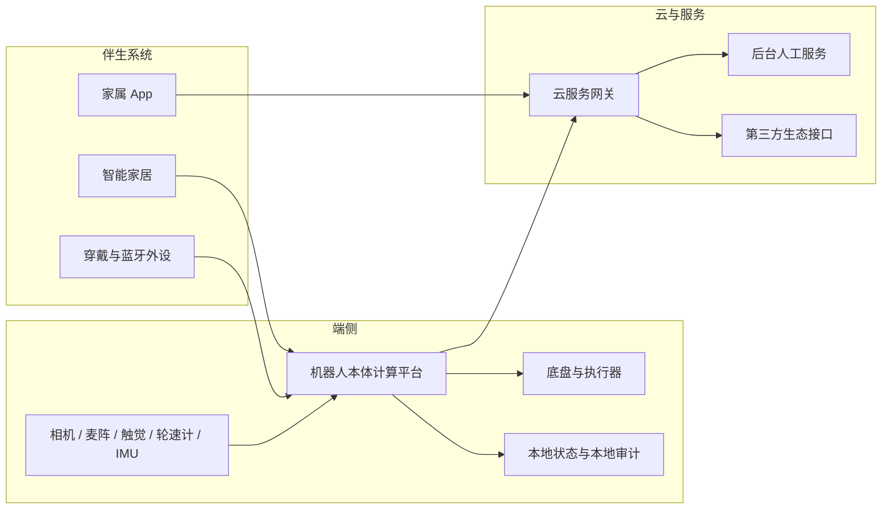
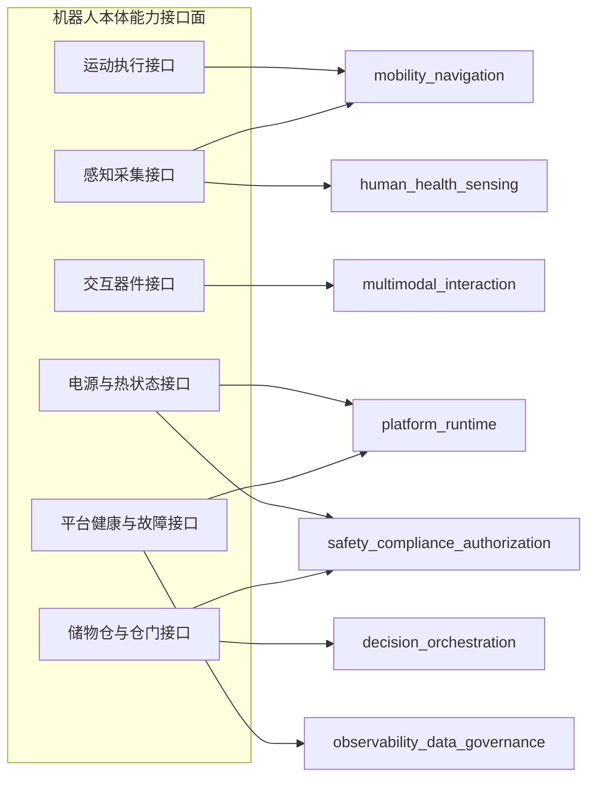

# Kinbot_OODA PDCP 系统架构评审包

## 1. 文档目的

本文档用于服务当前项目在 `IPD / PDCP` 节点的系统架构评审。

这份文档不再讨论“要不要做这个产品”，也不进入模块内部实现细节，而是回答 7 个评审层问题：

1. 目标机器人产品系统的完整边界是什么
2. 机器人本体与伴生系统如何共同构成完整产品系统
3. 一代系统架构的产品实体视图、运行时功能视图和一级闭环是什么
4. 系统运行时如何用多尺度 `OODA` 组织 Observe、Orient、Decide、Act
5. 哪些关键能力和关键接口已冻结，足以支撑模块并行设计
6. 当前明确不做什么、保留什么、观察什么
7. `PDCP` 评审通过后，各模块凭什么开始自己的架构与总体方案设计

## 2. 当前评审边界

### 2.1 本次评审覆盖

1. 产品系统边界
2. 本体与伴生系统关系
3. 总体架构与运行闭环
4. 一级模块与一级接口面
5. 关键横切约束
6. 模块下发基线

### 2.2 本次评审不覆盖

1. 最终器件定型
2. 最终 `BOM` 冻结
3. 量产导入、发布准备与交付执行细节
4. 各模块内部二级架构与实现方案

说明：

- 本次评审节点是 `P1 产品定义与架构冻结` 的一部分。
- `P5` 相关文档只作为远期约束输入存在，不代表当前项目已经进入量产导入阶段。

## 3. 目标产品系统定义

Kinbot 一代不是单一本体，而是一个完整产品系统：

当前产品系统边界收敛为：

1. 机器人本体是目标系统核心
2. 穿戴、健康外设、智能家居、App、云、后台人工服务是伴生系统
3. 第三方医院、药店、配送、社区和公共应急接口属于外部生态，不进入一代自建边界

## 4. 一代产品目标与架构定位

### 4.1 一代产品目标

一代目标用户与主价值已冻结为：

1. 中国大陆居家养老场景
2. 首发目标用户为独居老人或子女不在身边的老两口
3. 主价值排序为：健康管理 > 陪伴交互 > 老人看护 > 家庭安全巡护

### 4.2 一代系统定位

一代系统不是泛化家庭机器人，而是：

- 以健康闭环为主线
- 以陪伴交互为高频入口
- 以安全保障为底座
- 以伴生系统与人工服务为完整交付的一部分

## 5. 双视角总体架构基线

### 5.1 产品实体架构视图

`PDCP` 节点的系统架构不能只画运行时软件模块，还必须显式表达“机器人本体”这个软硬一体的产品实体。

当前建议把机器人本体在系统架构层收敛为 `6` 个本体实体域：

1. 计算与控制核心
2. 移动底盘与运动执行
3. 环境与人体感知组件
4. 交互表达组件
5. 电池电源、热与本体安全
6. 储物仓、结构与外观

这张图的作用不是冻结器件清单，而是回答三个架构层问题：

1. 机器人本体不是抽象容器，而是产品系统中的一级实体
2. 运行时软件模块必须运行在这些本体实体域之上，并受其结构、功耗、热和外观约束
3. 后续模块方案和整机方案不能只从软件视角下发，必须同时对齐本体实体域

### 5.2 本体实体域与运行时模块映射

| 本体实体域 | 主要承载模块 | 主要架构约束 |
| --- | --- | --- |
| 计算与控制核心 | `platform_runtime`、`world_state_memory`、`decision_orchestration`、`observability_data_governance` | 算力、存储、实时性、功耗、热设计 |
| 移动底盘与运动执行 | `mobility_navigation`、`safety_compliance_authorization` | 稳定性、通过性、噪声、续航、安全停机 |
| 环境与人体感知组件 | `human_health_sensing`、`mobility_navigation` | 视场、低光能力、时序同步、感知盲区 |
| 交互表达组件 | `multimodal_interaction` | 拾音、播音、可视性、情感表达、夜间舒适度 |
| 电池电源、热与本体安全 | `platform_runtime`、`safety_compliance_authorization`、`observability_data_governance` | 续航、充电、发热、故障保护、功耗调度 |
| 储物仓、结构与外观 | `multimodal_interaction`、`decision_orchestration`、`safety_compliance_authorization` | 重量、重心、仓门安全、可维护性、精致感 |

结论：

1. `9` 个一级模块继续有效，但它们表达的是运行时功能架构，不等于完整产品实体架构
2. `PDCP` 节点必须同时冻结“本体实体域”与“运行时模块域”这两张图
3. 模块 owner 后续提交方案时，既要说明软件接口，也要说明自己依赖和约束了哪些本体实体域

### 5.3 运行时功能架构视图

### 5.4 架构核心结论

1. 系统架构在 `PDCP` 节点采用“双视角基线”：产品实体架构视图 + 运行时功能架构视图
2. 总体方法论继续以 `OODA` 为主，但已冻结为多尺度、并发、可中断、可动态调度版本
3. `R1-R4` 四类子环已进入正式基线
4. `Orient` 已升级为“情境理解 + 认知评价 + 尺度选择”
5. `OODA Scale Scheduler` 已提升为一级架构能力
6. 所有高风险动作必须经过 `安全 / 合规 / 授权` 三道门

## 6. 产品系统部署架构

部署边界当前冻结为：

1. 直接处理原始视觉、语音、运动安全的能力必须在端侧
2. 家属联动、外部服务接入、问诊转接、运营配置等能力由云与伴生系统承接
3. 断网时运动安全与本地闭环不能失效

## 7. 四条一级业务闭环

### 7.1 健康闭环

`穿戴 / 外设 / 本体感知 -> 候选事件 -> 本地补采 -> 风险分级 -> 动作审批 -> 提醒 / 到人 / 递送 / 家属联动 / 人工服务 -> 归档`

### 7.2 陪伴闭环

`身份与上下文 -> 人设与主动触发判定 -> 交互规划 -> 多模态表达 -> 用户反馈 -> 记忆治理`

### 7.3 安全闭环

`空间与风险识别 -> 安全事件判定 -> 降级 / 硬停 / 回退 -> 家属与服务升级 -> 审计复盘`

### 7.4 服务闭环

`机器人本地服务 -> 家属 App / 云 -> 后台人工服务 -> 第三方履约 / 专业主体 -> 结果回写`

## 8. 一级模块与一级职责

| 一级模块 | 核心职责 | 不负责的事 |
| --- | --- | --- |
| `platform_runtime` | 驱动、时钟、事件总线、资源调度 | 业务决策 |
| `mobility_navigation` | 定位、建图、局部规划、底盘执行 | 高层任务目标判定 |
| `human_health_sensing` | 人体 / 身份 / 姿态 / 生命体征候选事件 | 最终医疗结论 |
| `multimodal_interaction` | 对话、屏幕、灯光、声音、多模态表达 | 高风险动作审批 |
| `world_state_memory` | 统一状态、短期 / 长期记忆、画像与上下文 | 直接执行动作 |
| `decision_orchestration` | 任务编排、行为仲裁、状态切换 | 绕过安全门控 |
| `safety_compliance_authorization` | 安全、合规、授权、审计前置门 | 交互表现层 |
| `companion_service_system` | App、云、运营坐席、外部平台网关 | 端侧安全闭环 |
| `observability_data_governance` | 日志、指标、审计、隐私与治理 | 业务主逻辑 |

## 9. 当前已冻结的关键接口面

在把“机器人本体”显式纳入系统架构之后，本次 `PDCP` 评审建议将以下接口面视为一级冻结边界：

### 9.1 本体能力接口面

`Body Capability Contract` 当前收敛为 `6` 组接口：

1. `motion_execution_contract`
2. `sensor_capture_contract`
3. `hmi_device_contract`
4. `power_thermal_state_contract`
5. `storage_cabin_contract`
6. `platform_fault_contract`

### 9.2 运行时关键接口面

在补入本体能力接口面后，以下运行时接口面可继续视为一级冻结边界：

1. `World State` 作为统一运行时状态平面
2. 分层状态机 + 行为树的控制结构
3. `ActionProposal / ApprovalDecision` 动作审批契约
4. 健康事件七段式管线
5. 陪伴交互记忆治理与主动触发边界
6. 储药与室内递送的一代边界
7. 伴生系统最小闭环与人工服务协同边界

结论：

1. 如果不补入本体能力接口面，当前一级接口面对模块并行设计并不充分
2. 在补入本体能力接口面后，`PDCP` 节点的一级接口面已达到可并行设计水平
3. 模块后续细化时，不允许再绕开这组一级接口直接跨域耦合

## 10. 一代明确不做的事

为保证 `PDCP` 评审边界稳定，一代当前明确不做以下事项：

1. 机械臂与复杂物理操作
2. 未经授权的高频主动干预
3. 把 `UWB` 作为主导航硬依赖
4. 把医疗专业判断放在机器人本地自动完成
5. 在当前节点冻结量产导入、发布执行和交付细节

## 11. `PDCP` 通过后对模块的下发要求

`PDCP` 通过后，各模块不再重新定义系统边界，而要基于本评审包继续细化自己的架构和总体方案。每个模块至少需要输出：

1. 模块架构图
2. 模块内部二级分层
3. 对外接口清单
4. 关键状态模型 / 数据模型
5. 关键技术路线与备选项
6. 风险清单与验证方案
7. 对上游 / 下游模块的依赖与约束

## 12. 本轮评审结论入口

本次 `PDCP` 系统架构评审建议聚焦以下 `6` 点：

1. 是否接受当前“机器人本体 + 伴生系统 + 外部生态”的完整产品系统边界。
2. 是否接受“本体 `6` 个实体域 + 运行时 `9` 个一级模块”的双视角总体架构基线。
3. 是否接受四条一级业务闭环作为一代系统主链。
4. 是否接受当前端侧 / 云侧 / 伴生系统的部署边界。
5. 是否接受补入 `Body Capability Contract` 后的一级接口面，足以支撑模块并行设计。
6. 是否接受 `PDCP` 通过后由模块进入各自架构与总体方案设计，而不再回退重定义系统边界。
