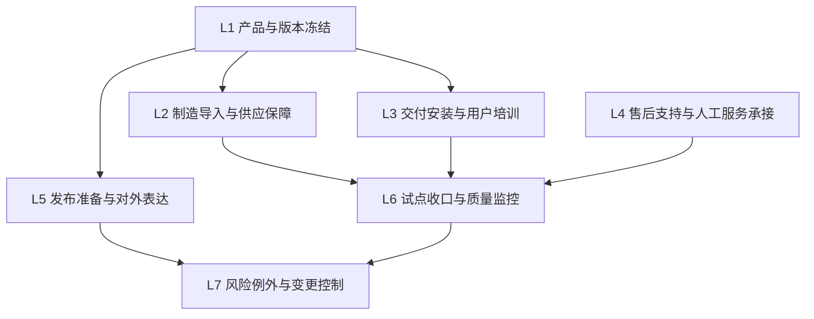

# Kinbot_OODA 量产导入、发布准备与交付闭环

## 1. 文档目的

本文档对应 `KBT-25`，用于把 `KBT-12` 的 `MVP` 验证计划继续推进到 `P5` 阶段的量产导入、发布准备与交付闭环。

当前要冻结的不是“发布时大概做什么”，而是先固定 5 件事情：

1. `可小批量试点`、`可交付`、`可开发布会` 三种状态分别意味着什么
2. 从 `Beta / DVT` 到 `2026-12-31` 量产预备之间，哪些工作包必须闭环
3. 交付、安装、售后、客服运营坐席和远程支持如何共同承接首批用户
4. 发布准备需要冻结哪些资料、演示链和风险口径
5. 哪些问题会阻止量产导入和对外交付

## 2. 当前设计前提

本版本基于以下已确认条件：

- 项目目标仍是 `2026-12-31` 达到量产预备状态
- `2027-01` 仍是首个 `MVP` 验证窗口
- `KBT-16` 已冻结 `G5` 量产预备门与 `7` 个判定域
- `KBT-12` 已冻结一代 `MVP` 范围、`100 台 / 100 户 / 1 个月` 试点框架与 `P / W / B` 放行规则
- 一代产品必须同时满足 `6000 到 8000 元` `BOM` 约束和 `20000 到 30000 元` 售价区间下的高端产品感要求
- 伴生系统、后台人工服务和第三方履约不是附属物，而是交付闭环的一部分

## 3. 为什么 `KBT-25` 需要独立冻结

如果不单独冻结量产导入、发布准备与交付闭环，后续会出现 6 类常见漂移：

1. 试点通过了，但没有形成对外交付所需的安装、培训和售后能力
2. 发布会可以讲故事，但交付资料、客服口径和远程支持没有准备好
3. 研发认为已经可发布，运营和质量团队却无法接住首批用户
4. 机器人本体表现稳定，但 App、云、坐席和履约接口在交付阶段断链
5. 首批用户问题只能靠研发人工兜底，无法转成标准化闭环
6. `可开发布会`、`可试点`、`可交付` 被混成一句口号，失去阶段门意义

因此，`KBT-25` 不是市场物料问题，而是 `P5` 阶段的系统闭环问题。

## 4. 七个闭环域

建议把 `KBT-25` 收敛为 `7` 个闭环域：

## 5. 三种状态定义

### 5.1 可小批量试点

含义：

- 已具备进入目标家庭运行的基础稳定性
- 已具备安装、培训、事件回收和问题升级能力
- 允许问题暴露，但不允许核心闭环缺失

一代默认要求：

1. 健康、陪伴、安全和伴生系统最小闭环可运行
2. 现场部署和回收流程明确
3. 远程日志、问题分级和人工接管路径可用

### 5.2 可交付

含义：

- 除了能试点，还能把机器人和伴生系统正式交到用户手里
- 交付后不依赖研发驻场才能使用

一代默认要求：

1. 安装、激活、绑定、联网和基础校准流程可标准化执行
2. 用户培训、家属培训和服务说明材料齐备
3. App、云、客服和售后知道如何承接常见问题

### 5.3 可开发布会

含义：

- 不只是能演示，还要能稳定表达产品主张、边界和交付预期
- 对外讲法不能与真实能力脱节

一代默认要求：

1. 主价值链可稳定演示
2. 对外口径、边界声明、风险提示和服务承诺一致
3. 外观、交互、安静感、轻盈感和整体完成度能支撑高端产品感

## 6. 各闭环域的冻结内容

### 6.1 `L1` 产品与版本冻结

至少冻结以下内容：

1. 本体硬件版本
2. 伴生系统版本组合
3. 首批套餐能力边界
4. 发布演示链清单
5. 阻断项清单和例外批准机制

### 6.2 `L2` 制造导入与供应保障

至少冻结以下内容：

1. 小批量试产节奏
2. 关键器件和替代料策略
3. 产测、校准和出厂检查清单
4. 包装、物流和返修回流路径

### 6.3 `L3` 交付安装与用户培训

至少冻结以下内容：

1. 入户安装和激活流程
2. 机器人、App、穿戴和家属账号绑定流程
3. 老人本人、子女和保姆的角色培训材料
4. 首日、首周和首月的使用指导策略

### 6.4 `L4` 售后支持与人工服务承接

至少冻结以下内容：

1. 客服首线问题分级
2. 远程诊断、日志回收和升级路径
3. 上门支持或合作支持的触发条件
4. 医疗专业主体、第三方履约和平台责任边界的对外口径

### 6.5 `L5` 发布准备与对外表达

至少冻结以下内容：

1. 发布会演示脚本和演示兜底方案
2. 核心卖点、禁讲点和风险口径
3. 价格、套餐和服务说明
4. 资料包、FAQ 和渠道培训材料

### 6.6 `L6` 试点收口与质量监控

至少冻结以下内容：

1. `100 台 / 100 户 / 1 个月` 试点中的问题分类口径
2. `P / W / B` 问题流转路径
3. 高风险事件日报、周报和复盘机制
4. 量产导入前的问题关闭标准

### 6.7 `L7` 风险例外与变更控制

至少冻结以下内容：

1. 哪些问题允许带病进入下一阶段
2. 哪些问题必须阻断发布和交付
3. 版本变更、配置变更和供应变更的批准路径
4. 对“聪明、温暖、精致”高端产品感的破坏性检查

## 7. 一代默认阻断项

以下问题在 `KBT-25` 中建议默认按阻断项处理：

1. 首批交付仍依赖研发驻场兜底
2. 发布口径与真实能力明显不一致
3. 安装、绑定、培训和售后流程无法标准化
4. 客服、云和 App 无法承接首批用户问题
5. 首批试点中的高风险问题没有形成统一分级与复盘
6. 显著损伤“聪明、温暖、精致”的高端产品感
7. 关键版本、关键资料或关键责任边界仍然漂移

## 8. 与现有基线的关系

`KBT-25` 与现有文档关系建议冻结为：

1. 与 [docs/MASS_PRODUCTION_READINESS_CRITERIA.md](docs/MASS_PRODUCTION_READINESS_CRITERIA.md) 的关系：后者定义 `G5` 判定门，本文定义 `P5` 如何把判定门变成发布与交付闭环。
2. 与 [docs/MVP_VALIDATION_PLAN.md](docs/MVP_VALIDATION_PLAN.md) 的关系：后者定义试点验证什么，本文定义试点之后如何收口并承接交付。
3. 与 [docs/ENGINEERING_NPI_BASELINE.md](docs/ENGINEERING_NPI_BASELINE.md) 的关系：后者定义工程化输入，本文定义量产导入前的组织和交付准备。
4. 与 [docs/HUMAN_SERVICE_AND_TELEMEDICINE_BOUNDARIES.md](docs/HUMAN_SERVICE_AND_TELEMEDICINE_BOUNDARIES.md) 的关系：后者定义角色边界，本文定义首批交付时这些角色如何被运营体系真正接住。

## 9. 当前提案中的待审点

以下 `4` 点作为 `KBT-25` 的正式评审入口：

1. 是否接受 `L1-L7` 这 `7` 个闭环域。
2. 是否接受把 `可小批量试点`、`可交付`、`可开发布会` 拆成三种不同状态，而不是混成一个笼统结论。
3. 是否接受当前的 `L3-L4-L5` 分工，也就是把交付安装、售后承接、发布准备拆成三条独立闭环。
4. 是否接受当前 `7` 条默认阻断项，尤其是把“研发驻场兜底”“发布口径失真”“高端产品感明显受损”列为阻断项。
