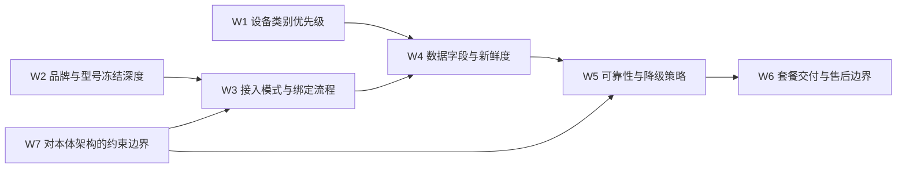

# 一期穿戴设备兼容范围与数据字段

## 1. 文档目的

本文档用于冻结一代产品在穿戴设备与家用生命体征外设上的兼容范围、接入边界与数据字段要求。

当前要回答的不是“把所有品牌设备都接上”，而是先固定 5 件对架构和量产最关键的事情：

1. 一代优先兼容哪些设备类别
2. 当前品牌和型号冻结到什么深度
3. 数据采集的首选方式、兜底方式和新鲜度约束是什么
4. 哪些字段是首版必须打通的，哪些可以后置
5. 这些设备怎样作为伴生系统输入，不反向锁死机器人本体路线

## 2. 当前设计前提

本版本基于以下已确认条件：

- 一期生命体征接入优先绑定穿戴设备，同时保留血压计等家用测量设备的软件接口
- 穿戴外设不自研，首发希望采用“机器人 + 推荐设备套餐”的交付方式
- 兼容优先级已冻结为：手表 / 手环 > 蓝牙血压计 > 蓝牙血糖仪 > `UWB`
- 当前品牌优先级暂定为小米、华为
- 一期尚未形成明确的穿戴设备具体型号清单
- 任意品牌手表若想实时获取心率，通常依赖心率广播或官方 `SDK`；前者会影响用户正常使用，后者需要合作认证
- 一期不能把持续实时手表心率当作稳定硬依赖
- 当实时链路受限时，一期要更多依赖问诊式交互、`BLE` 外设补采和最近一次有效数据
- 当前已冻结的数据新鲜度是：心率和血氧延迟不超过 `1 分钟`，血压按需测量但要求每日更新

## 3. 为什么 `KBT-15` 需要独立冻结

如果不单独冻结穿戴兼容范围与数据字段，会直接导致 6 类漂移：

1. 健康事件管线无法稳定定义“哪些信号是首版硬输入”
2. `World State` 无法固定 `device_binding_refs`、`wearable_freshness_state` 和 `vital_signal_sources` 的表达边界
3. 审批接口无法判断数据新鲜度不足时该如何降级
4. 套餐交付、绑定流程、权限申请和售后支持无法产品化
5. 机器人本体会被协议碎片化和设备差异反向拖住
6. 后续 `KBT-14` 的 `UWB` 评估无法放在正确位置，它应是观察线而不是当前主线输入

因此，`KBT-15` 是技术路线评估里的正式冻结项。

## 4. 一级范围结构

一代建议把穿戴兼容范围与数据字段收敛为 7 个一级能力包：

说明：

- `W1` 到 `W3` 更偏设备范围和接入方式。
- `W4` 到 `W5` 更偏运行时数据质量。
- `W6` 到 `W7` 用来保证交付闭环和本体边界不漂移。

## 5. 一期兼容优先级

当前建议把一代兼容范围冻结为 4 层：

| 优先级 | 设备类别 | 当前定位 |
| --- | --- | --- |
| `P1` | 手表 / 手环 | 运动状态、心率、血氧等准连续输入主线 |
| `P2` | 蓝牙血压计 | 日常监测与异常复核主线 |
| `P3` | 蓝牙血糖仪 | 慢病用户扩展输入 |
| `P4` | `UWB` 设备 | 观察线，不阻塞当前主线 |

说明：

1. `P1` 不是要求“所有手表都能稳定实时广播”，而是要求首版围绕一小批合作品牌先打通基本输入链。
2. `P2` 和 `P3` 负责补足按需测量，不让本体被迫堆重型医疗传感器。
3. `P4` 当前只保留观察位，等待 `KBT-14` 再决定是否进入首版。

## 6. 品牌与型号冻结深度

一代建议把品牌与型号冻结分成 3 层，而不是一开始追求完整清单：

| 层级 | 当前建议 | 说明 |
| --- | --- | --- |
| `L1 品牌层` | 小米、华为 | 当前已确认的优先品牌层 |
| `L2 产品线层` | 手表 / 手环、血压计、血糖仪 | 当前应先冻结到产品线层 |
| `L3 具体型号层` | `provisional` | 进入合作谈判和实际接入验证后再冻结 |

当前判断：

1. 现在进入架构冻结阶段，不必假装已经有完整型号清单。
2. 当前更重要的是先冻结“允许哪些设备类型进入首版”和“每类需要哪些字段”。
3. 具体型号应在后续接入验证和商务合作中逐步补齐。

## 7. 接入模式与绑定流程

一代建议把接入模式收敛为 5 类：

| 模式 | 用途 | 当前定位 |
| --- | --- | --- |
| `sdk_bound` | 通过官方 `SDK` / 合作能力读取 | 优先主线 |
| `broadcast` | 通过设备广播获取有限实时数据 | 受限可用 |
| `ble_measurement` | `BLE` 外设按需测量 | 必须支持 |
| `questionnaire_driven` | 问诊式补采 | 必须支持 |
| `manual_input` | App / 用户手填 | 兜底 |

绑定流程建议冻结为：

1. App 侧选择设备类别与品牌
2. 完成账号或蓝牙绑定
3. 授权所需数据范围
4. 机器人同步设备能力摘要，而不是直接依赖原始协议细节
5. 运行时根据 `wearable_freshness_state` 判断是走实时输入、补采还是人工兜底

## 8. 一期数据字段

一代建议把首版字段收敛为 7 类：

| 字段组 | 具体字段 | 当前定位 |
| --- | --- | --- |
| `D1 身份与绑定` | 设备 ID、品牌、型号、绑定状态、绑定用户 | 必须有 |
| `D2 采集模式` | `sdk_bound` / `broadcast` / `ble_measurement` / `questionnaire_driven` / `manual_input` | 必须有 |
| `D3 运动状态` | 静止 / 运动中、最近活动时间 | 必须有 |
| `D4 心率` | 数值、时间戳、数据来源、新鲜度 | 必须有 |
| `D5 血氧` | 数值、时间戳、数据来源、新鲜度 | 应该有 |
| `D6 血压` | 收缩压、舒张压、测量时间、设备来源 | 必须有 |
| `D7 血糖` | 数值、测量时间、设备来源 | 可以有 |

说明：

1. 当前首版并不要求所有 `P1` 设备都能提供全部字段。
2. 字段冻结的重点是：系统必须知道“这个值来自哪里、何时测得、当前是否还值得信任”。
3. 对健康判断更关键的是“字段 + 时间戳 + 来源 + 新鲜度”四元组，而不是只拿一个裸数值。

## 9. 新鲜度与可靠性要求

当前建议与既有健康基线保持一致：

| 字段 | 一期目标 | 主要兜底 |
| --- | --- | --- |
| 心率 | 不超过 `1 分钟` 延迟 | 问诊、到人观察、`BLE` 补采 |
| 血氧 | 不超过 `1 分钟` 延迟 | 问诊、`BLE` 补采 |
| 血压 | 每日更新，必要时即时补测 | 用药 / 问诊链提示未完成 |
| 血糖 | 事件驱动或按需补测 | App 记录或手动输入 |
| 运动状态 | 最近一次有效状态即可 | 本体视觉与问诊兜底 |

可靠性原则建议冻结为：

1. 低新鲜度心率不能直接驱动高风险自动动作。
2. 单一穿戴数据源不能替代本地问诊和多源确认。
3. 当设备断连、广播不可用或 `SDK` 不可得时，系统必须自动降级，而不是报错中断主流程。

## 10. 套餐交付与售后边界

当前建议：

1. 一期优先走“推荐 / 打包标准设备”，不走完全 `BYOD`。
2. 售后与客服侧需要知道用户绑定的是哪类设备、当前走哪种采集模式。
3. 套餐策略的目标是降低接入碎片化，而不是强行自研外设。
4. 穿戴与家用外设作为伴生系统，应通过稳定接口约束本体，而不是反向决定本体主控和传感器路线。

## 11. 与现有架构文档的接口关系

`KBT-15` 与现有基线的关系建议冻结为：

1. 与 [docs/健康事件管线与升级链路.md](docs/健康事件管线与升级链路.md) 的关系：本文冻结信号源优先级、字段和新鲜度，作为健康事件管线的稳定输入。
2. 与 [docs/世界状态结构.md](docs/世界状态结构.md) 的关系：`device_binding_refs`、`vital_signal_sources`、`wearable_freshness_state` 等字段承接本文定义。
3. 与 [docs/安全合规授权接口.md](docs/安全合规授权接口.md) 的关系：数据新鲜度不足时，审批层必须支持补采、复核和降级。
4. 与 [docs/软硬件选型矩阵.md](docs/软硬件选型矩阵.md) 的关系：穿戴与家庭设备生态只通过接口约束本体，不反向锁死本体主控路线。
5. 与 `KBT-14` 的关系：`UWB` 当前只保留观察线地位，不阻塞 `KBT-15` 的主线冻结。

## 12. 本轮收口结论与后续问题

`Step27` 已对 `KBT-15` 形成当前轮次收口，结论如下：

1. 接受把一期兼容范围冻结到“设备类别 + 品牌层 + 产品线层”，而不在当前阶段假装已经有完整型号清单。
2. 接受 `sdk_bound / broadcast / ble_measurement / questionnaire_driven / manual_input` 这 `5` 类接入模式。
3. 接受当前的 `7` 类首版数据字段分组，尤其是把“时间戳、来源、新鲜度”与生命体征值一起作为必要字段。
4. 从技术上接受把 `UWB` 继续保留为观察线，不阻塞当前穿戴主线冻结。

本轮同步收敛出的额外边界：

- `KBT-15` 当前先冻结穿戴主线，不等待 `UWB` 结果回填。
- 用户近期将拿到 `UWB` 外设样品；样品测试结果将作为后续 `KBT-14` 和 `docs/REQUIREMENTS.MD` 的增量输入。
- 一期穿戴主线仍然是“手表 / 手环 + 家用测量外设 + 问诊补采”的组合，而不是等待单一 `UWB` 路线成熟。

当前仍保留的后续问题：

1. 哪些具体型号会进入首批套餐或白名单，需要在后续商务合作和接入验证后补齐。
2. `sdk_bound` 与 `broadcast` 在小米 / 华为体系下的真实可用性，需要用样机和合作条件做实证验证。
3. `UWB` 样品验证完成后，是否有任何能力值得从观察线上调到增强线，需要在 `KBT-14` 中单独关闭。
