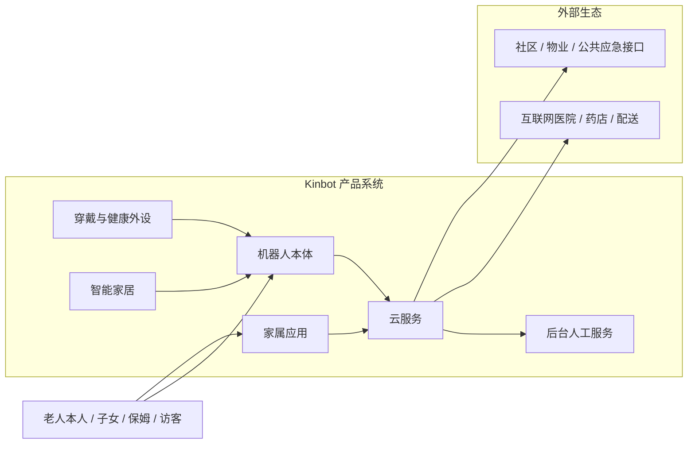
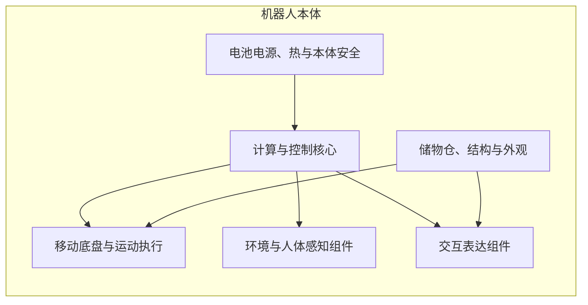
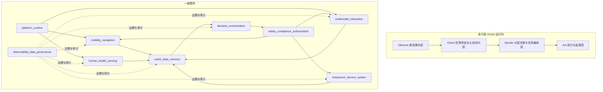
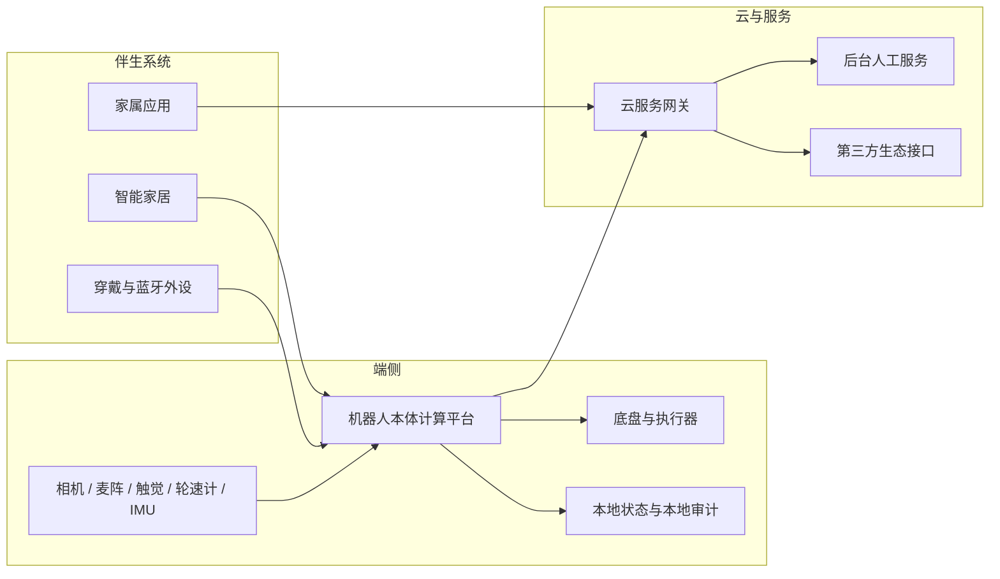

# 总体架构

## 1. 文档定位

本文档是当前项目的总体架构总览文档。

它服务于两个目标：

1. 作为早期设计文档的回归基线，统一项目当前已经冻结的系统架构事实
2. 作为后续 `PDCP` 评审、总体方案下发和模块并行设计的总入口

这份文档不再承担所有细节展开职责。更细的结构、接口、状态机、功能域和工程化约束，分别下沉到对应专题文档。

## 2. 当前冻结边界

当前阶段已经明确：

1. 项目处于“产品需求基本完成后的系统架构设计与技术研判阶段”
2. 当前主线是 `P1 / PDCP`，而不是量产导入或发布准备
3. 当前首要目标是形成完整系统架构基线，并把它转成总体方案与模块下发基线

一代产品边界继续冻结为：

1. 中国大陆居家养老机器人
2. 主价值排序：健康管理 > 陪伴交互 > 老人看护 > 家庭安全巡护
3. 机器人不做机械臂和复杂物理操作
4. 机器人本体与伴生系统共同构成完整产品系统

## 3. 产品系统边界

Kinbot 一代不是单一机器人本体，而是一个完整产品系统：

边界结论：

1. 机器人本体是目标系统核心
2. 穿戴、智能家居、家属应用、云服务、后台人工服务是伴生系统
3. 外部医疗、药店、配送、社区和公共应急接口属于外部生态，不进入一代自建边界

## 4. 双视角总体架构基线

当前系统架构已经不再只从软件分层表达，而是采用双视角基线：

1. 产品实体架构视图
2. 运行时功能架构视图

### 4.1 产品实体架构视图

机器人本体在系统架构层当前收敛为 `6` 个本体实体域：

1. 计算与控制核心
2. 移动底盘与运动执行
3. 环境与人体感知组件
4. 交互表达组件
5. 电池电源、热与本体安全
6. 储物仓、结构与外观

这张图表达的是产品实体，不是器件清单。它的作用是约束后续软件、算法、结构、整机和伴生系统方案必须共同回到同一个本体实体框架。

### 4.2 运行时功能架构视图

运行时功能架构继续冻结为 `9` 个一级模块：

1. `platform_runtime`
2. `mobility_navigation`
3. `human_health_sensing`
4. `multimodal_interaction`
5. `world_state_memory`
6. `decision_orchestration`
7. `safety_compliance_authorization`
8. `companion_service_system`
9. `observability_data_governance`

### 4.3 双视角一致性检查机制

为避免“本体实体架构”和“运行时功能架构”在后续模块设计中重新漂移，当前基线同步冻结以下机制：

1. 每个模块方案都必须声明自己依赖和约束了哪些本体实体域
2. 本体实体域变更必须评估对 `9` 个一级模块、四条一级业务闭环和关键接口面的影响
3. 运行时模块变更如果影响算力、传感器、功耗、热、重量、仓门安全或外观，必须回写到本体实体域评审
4. `KBT-32` 和后续模块方案评审，必须把“双视角一致性检查”作为固定审阅项

## 5. 多尺度 OODA 基线

Kinbot 当前正式方法论不是固定单轮 OODA，而是多尺度、并发、可中断、可动态调度的 OODA。

四类子环已经冻结：

1. `R1` 反射环：毫秒到百毫秒级，负责底盘级安全和快速保护
2. `R2` 执行环：秒级，负责局部执行、到人确认、动作监督
3. `R3` 任务环：秒到分钟级，负责任务推进、异常升级和编排
4. `R4` 关系与服务环：小时到天级，负责长期记忆、习惯学习和服务编排

其中：

1. `Orient` 已升级为“情境理解 + 认知评价 + 尺度选择”
2. `OODA Scale Scheduler` 已提升为一级架构能力
3. 所有动作在执行前都必须经过安全、合规、授权三道门

## 6. 部署边界

当前部署边界已经冻结为：

1. 原始视觉、语音、运动安全和本地执行保护必须在端侧
2. 家属联动、外部服务接入、问诊转接、运营配置和第三方服务网关由伴生系统与云侧承接
3. 断网时运动安全与本地闭环不能失效

## 7. 四条一级业务闭环

### 7.1 健康闭环

`穿戴 / 外设 / 本体感知 -> 候选事件 -> 本地补采 -> 风险分级 -> 动作审批 -> 提醒 / 到人 / 递送 / 家属联动 / 人工服务 -> 归档`

### 7.2 陪伴闭环

`身份与上下文 -> 人设与主动触发判定 -> 交互规划 -> 多模态表达 -> 用户反馈 -> 记忆治理`

### 7.3 安全闭环

`空间与风险识别 -> 安全事件判定 -> 降级 / 硬停 / 回退 -> 家属与服务升级 -> 审计复盘`

### 7.4 服务闭环

`机器人本地服务 -> 家属应用 / 云 -> 后台人工服务 -> 第三方履约 / 专业主体 -> 结果回写`

## 8. 一级接口与治理基线

当前一级接口与治理基线由两部分共同构成。

### 8.1 本体能力接口面

`Body Capability Contract` 当前收敛为 `6` 组接口：

1. `motion_execution_contract`
2. `sensor_capture_contract`
3. `hmi_device_contract`
4. `power_thermal_state_contract`
5. `storage_cabin_contract`
6. `platform_fault_contract`

### 8.2 运行时关键接口面

当前已经冻结的运行时关键接口面包括：

1. `World State` 统一状态平面
2. 分层状态机 + 行为树控制结构
3. `ActionProposal / ApprovalDecision` 动作审批契约
4. 健康事件七段式管线
5. 陪伴交互记忆治理与主动触发边界
6. 储药与室内递送一代边界
7. 伴生系统最小闭环与人工服务协同边界

### 8.3 接口稳定性策略

为支撑模块并行设计，当前一级接口稳定性策略冻结为：

1. 一级接口先冻结抽象职责和责任边界，再允许底层器件、协议和实现细节继续演进
2. 一级接口必须显式声明 `owner`
3. 一级接口必须带版本号
4. 一级接口变更必须经过架构评审，并明确是否保持向后兼容

## 9. 当前一级架构风险输入

以下三项已经被提升为后续总体方案与模块设计的一级阻断输入：

1. `D1` 端侧算力平台未收敛
2. `D6` 整机平台与关键器件基线未冻结
3. `D7` 伴生系统最小闭环缺失

它们不在本文件里直接完成定型，但后续 `KBT-32` 和模块方案必须显式回应。

## 10. 与专题文档的关系

本文件只负责给出总览基线，具体细节分别下沉到以下文档：

1. `docs/多尺度动态OODA架构基线.md`：多尺度 OODA 方法论细化
2. `docs/模块分层与模块边界.md`：一级模块边界
3. `docs/世界状态结构.md`：世界状态结构
4. `docs/决策状态机.md`：分层状态机与行为树边界
5. `docs/安全合规授权接口.md`：统一动作审批契约
6. `docs/PDCP系统架构评审包.md`：`PDCP` 正式评审包
7. `docs/总体方案与模块方案下发基线.md`：总体方案与模块下发基线

## 11. 当前结论

当前总体架构已经从早期的泛化分层描述，收敛为一套可以支撑 `PDCP` 评审与模块并行设计的正式基线：

1. 产品系统边界已冻结
2. 双视角总体架构基线已冻结
3. 多尺度 OODA 方法论已冻结
4. 一级业务闭环已冻结
5. 一级接口与治理基线已冻结
6. 后续工作主线已转入总体方案下发与模块方案设计
