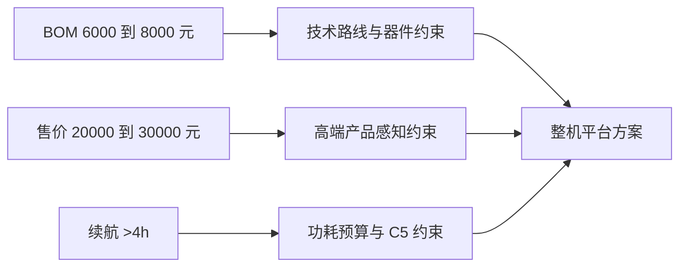
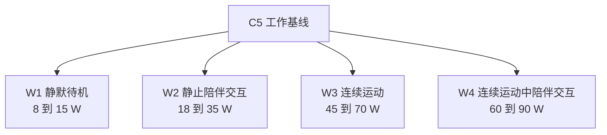
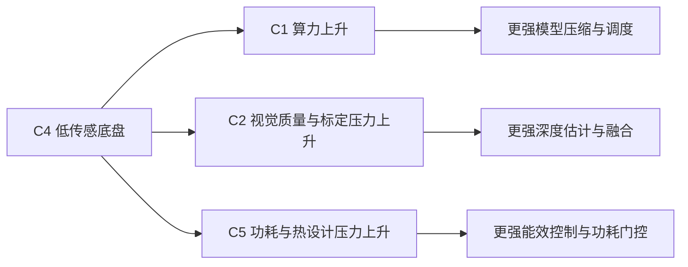

# 整机功耗预算与能效控制策略

## 1. 文档目的

本文档对应 `KBT-30`，用于把一代机器人的功耗预算、能效控制、`C5` 工作基线和阶段门检查收敛成可执行基线。

本文档回答 5 个问题：

1. 一代整机的功耗预算应该按哪些工况定义，而不是按单一点功率定义。
2. `C5` 的工作基线如何冻结，才不会只靠主观经验拍脑袋。
3. `C4` 低传感路线会如何把成本和功耗压力转移到 `C1 / C2 / C5`。
4. 如何把 `6000 到 8000 元` 的 `BOM` 约束，与 `20000 到 30000 元` 的售价监控区间一起纳入基线。
5. 如何确保能效优化不会把机器人做成“不聪明、不温暖、不精致”的廉价产品。

说明：

- 本文档当前是 `P1` 到 `P2` 之间的工作基线，不是最终量产参数单。
- 下文涉及功率、能量和成本的数值，均用于路线收敛和评审，不等于最终硬件定型值。

## 2. 双基线约束

`KBT-30` 不能只回答续航和发热，还必须同时回答产品经济性和产品感知。

### 2.1 当前双基线

| 维度 | 当前约束 | 当前监控区间 | 作用 |
| --- | --- | --- | --- |
| `BOM 基线` | `6000 到 8000 元` | 以 `6800 元` 滚动中值监控 | 约束整机物料与技术路线 |
| `售价基线` | `20000 到 30000 元` | 当前按高端价格带持续监控 | 约束整机与服务组合是否仍有高端产品感 |
| `续航目标` | `>4h` | 以典型混合工况评估 | 约束 `C5`、调度、热设计与待机策略 |

### 2.2 双基线关系图

当前判断：

- `BOM` 负责约束“能不能做出来”。
- 售价监控区间负责约束“做出来之后是否仍然像一款高端机器人产品”。
- 续航目标负责约束“这个方案是否能长期稳定工作，而不是靠临时堆电池和堆散热”。

## 3. `C5` 的四类工作工况基线

按 `Step24`，当前 `C5` 的工作基线不再按粗粒度三类工况定义，而是按以下四类工况冻结：

1. `W1 静默待机`
2. `W2 静止时的陪伴交互`
3. `W3 连续运动`
4. `W4 连续运动中的陪伴交互`

### 3.1 四类工况定义

| 工况 | 典型场景 | 主耗电影响项 | 当前工作功率建议 |
| --- | --- | --- | --- |
| `W1 静默待机` | 夜间静默守护、低活动监测、待命 | 基础传感、低频计算、联网待机 | `8 到 15 W` |
| `W2 静止时的陪伴交互` | 原地对话、提醒、表情灯光、屏幕交互 | 语音前端、屏幕、轻中负载推理 | `18 到 35 W` |
| `W3 连续运动` | 找人、巡航、回充、室内递送 | 电机驱动、底盘控制、导航感知 | `45 到 70 W` |
| `W4 连续运动中的陪伴交互` | 边移动边对话、边找人边播报、边递送边确认 | 电机驱动、导航感知、语音与推理并发 | `60 到 90 W` |

说明：

- 上表是当前工作基线提案，不是最终冻结结果。
- `W4` 是当前最危险工况，因为它最容易同时拉高 `C1`、`C4` 和 `C5`。
- 如果后续大量功能设计把真实使用时间推向 `W4`，那么 `C5` 和热设计很可能直接越界。

### 3.2 四类工况结构图

## 4. 混合工况功耗预算方法

### 4.1 预算方法

当前不建议用“峰值功率”直接定义续航，而建议用混合工况平均功率：

`P_mix = r1*P_W1 + r2*P_W2 + r3*P_W3 + r4*P_W4`

其中：

- `r1` 到 `r4` 为四类工况在典型任务周期中的时间占比，总和为 `1`
- `P_W1` 到 `P_W4` 为四类工况的平均功率

续航约束按下式评估：

`E_usable >= 1.25 * T_target * P_mix`

说明：

- `E_usable` 为可用电量
- `T_target` 当前按 `4h` 目标评估
- `1.25` 为控制老化、温漂、峰值波动和安全余量的当前建议系数

### 4.2 当前建议的代表性混合工况

作为当前收敛起点，建议先采用以下代表性占比做评估：

| 工况 | 当前建议时间占比 |
| --- | --- |
| `W1 静默待机` | `20%` |
| `W2 静止陪伴交互` | `40%` |
| `W3 连续运动` | `20%` |
| `W4 连续运动中的陪伴交互` | `20%` |

按各工况中值估算，当前 `P_mix` 应控制在约 `39 到 47 W` 的收敛带内；若显著超出，需要优先从调度和交互策略回收，而不是先加大电池。

## 5. `C4 -> C1 / C2 / C5` 的成本与功耗转移

### 5.1 转移逻辑

`Step22` 和 `Step24` 的核心意思都很明确：

- 当前成本量级下，`C4` 更可能采用低传感底盘路线。
- 低传感路线并不意味着系统更简单，而是把复杂度转移给视觉、算力和能效控制。

### 5.2 当前评审要求

后续任何低传感底盘方案，都必须显式回答 4 个问题：

1. 对 `C1` 增加了多少端侧算力、内存或带宽压力。
2. 对 `C2` 增加了多少相机质量、标定或视觉算法压力。
3. 对 `C5` 增加了多少平均功耗、峰值功耗和热设计压力。
4. 是否让机器人在移动、找人、跟随、过门槛和避障时显得更笨、更慢或更不从容。

## 6. 高端产品感知检查表

`Step24` 与 `Step25` 进一步明确：以后每次显著降本动作都要附带“高端产品感知检查表”，而且监控目标不再写成单一点售价，而是按 `20000 到 30000 元` 售价区间持续监控。

### 6.1 六个检查维度

| 维度 | 关注点 | 不能退化成什么 |
| --- | --- | --- |
| `聪明感` | 找人、识人、理解任务、主动性是否自然 | 明显迟钝、经常误解、任务感很弱 |
| `舒适感` | 语音、灯光、表情、材料、声学和心理感受是否舒适 | 刺激、压迫、冷冰冰、让人疲惫 |
| `精致感` | 外观、结构、屏幕、装配、细节是否高级 | 廉价 IoT 感 |
| `轻盈感` | 移动、转向、停靠、避障和空间存在感是否轻快且不笨重 | 沉重、迟缓、臃肿、占空间 |
| `可信感` | 状态切换、响应、权限、安全是否可预期 | 行为突兀、不透明 |
| `支持感` | 本体与 App、云、坐席是否形成被支持、被照护的整体体验 | 关键价值都被外包到手机上 |

补充归属：

- `安静感` 当前作为 `舒适感` 与 `轻盈感` 的交叉观察面，既是声学问题，也是心理问题。
- `宽敞感` 当前作为 `轻盈感` 与 `精致感` 的交叉观察面，用于判断机器人在家庭空间中的高端存在感。

### 6.2 阶段门使用方式

后续所有显著影响成本、功耗、结构、交互或伴生系统裁剪的方案，必须同时给出：

1. `BOM` 影响
2. 续航与功耗影响
3. 六维高端产品感知影响
4. 对 `20000 到 30000 元` 售价监控区间的影响判断

若一个方案在六维中明显损伤 2 个以上维度，则不能仅因为 `BOM` 更低而通过。

## 7. `G2` 前的验证与冻结项

### 7.1 当前必须新增的验证项

1. 完成 `W1` 到 `W4` 四类工况的平均功率与峰值功率实测。
2. 完成代表性混合工况下的 `P_mix` 实测与 `>4h` 续航核算。
3. 完成至少一条 `C4` 低传感路线的成本与功耗转移评估。
4. 完成至少一版“高端产品感知检查表”试运行。
5. 完成 `BOM 6000 到 8000 元` 与 `售价 20000 到 30000 元` 的双基线看板。

### 7.2 当前冻结口径

当前建议先冻结以下口径：

1. `C5` 当前仍只有工作基线，没有最终冻结成本基线。
2. `W1` 到 `W4` 四类工况作为后续所有功耗预算的统一口径。
3. 不允许通过“简单增大电池”掩盖调度、算法、热设计和交互策略问题。
4. 不允许只看 `BOM` 或只看续航，必须同时看售价区间和高端产品感知。

## 8. 当前建议的后续动作

1. `KBT-30` 已完成当前轮次评审收口，后续进入四类工况下 `C5` 工作基线的实测冻结阶段。
2. 在 `docs/成本结构与技术降本路径.md` 中继续维护 `BOM + 售价` 双基线。
3. 在下一轮功耗评审里，把“静默待机 / 静止陪伴 / 连续运动 / 连续运动中陪伴交互”四类工况直接作为评审模板。
4. 后续每轮都继续复查 `In Review` issue 是否与本地事实源一致，避免工作流和真实基线再次脱节。
