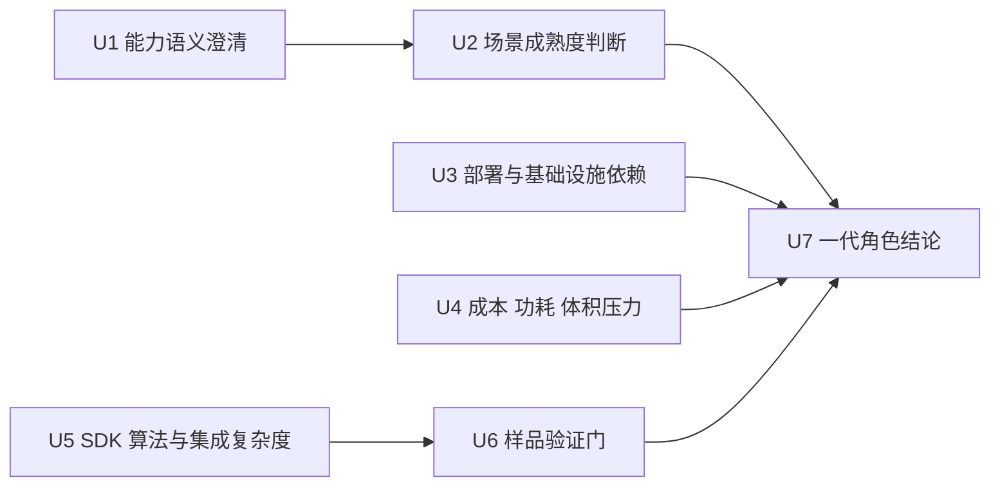

# 超宽带（UWB）一期技术成熟度与接入价值评估

## 1. 文档目的

本文档用于冻结一代产品中 `UWB` 路线的技术定位、成熟度判断和接入边界。

当前要回答的不是“`UWB` 能不能做很多事”，而是先固定 5 件对一代架构和量产最关键的事情：

1. `UWB` 在 Kinbot 里到底指哪类能力
2. 它在粗定位、活动状态判断、生命体征监测上分别成熟到什么程度
3. 它是否值得进入一代标准 `BOM`
4. 它会给本体、伴生系统、部署和售后带来什么额外负担
5. 当前样品阶段应该验证什么，哪些结果才足以改变路线

## 2. 当前设计前提

本版本基于以下已确认条件：

- 一期设备兼容优先级已冻结为：手表 / 手环 > 蓝牙血压计 > 蓝牙血糖仪 > `UWB`
- `UWB` 当前只保留观察线地位，不阻塞穿戴主线冻结
- 当前候选用途优先级已冻结为：活动状态判断 > 粗定位 > 生命体征监测
- 用户近期将拿到 `UWB` 外设样品，样品测试结果后续会回写 `docs/REQUIREMENTS.MD`
- 一代本体必须严格受 `6000 到 8000 元` `BOM`、`C5` 功耗和高端产品感知护栏约束

## 3. 为什么 `KBT-14` 需要独立冻结

如果不把 `UWB` 单独冻结，会直接导致 6 类漂移：

1. 穿戴主线会反复被“也许可以用 `UWB` 替代”拖慢
2. 本体感知栈会误把观察线当成首版硬依赖
3. 成本和功耗会被不成熟器件隐性抬升
4. 样品测试没有明确通过条件，结论难以沉淀
5. “`UWB` 测距”和“`UWB` 雷达感知”会被混成一个概念
6. 一代 `BOM` 是否引入额外基础设施会失去边界

因此，`KBT-14` 是技术路线评估里的正式冻结项。

## 4. 一级评估结构

建议把 `UWB` 评估收敛为 7 个一级维度：

说明：

- `U1` 到 `U3` 用来回答“它是什么、能做什么、要付出什么部署代价”。
- `U4` 到 `U6` 用来回答“它是否值得进入一代实装路线”。
- `U7` 给出一代正式结论。

## 5. 术语澄清

当前必须先把两类 `UWB` 路线分开：

| 路线 | 典型形态 | 当前用途 |
| --- | --- | --- |
| `UWB ranging` | 标签、锚点、测距芯片 | 粗定位、距离感知、区域存在判断 |
| `UWB radar / sensing` | 近场感知芯片、雷达式生命体征或动作感知 | 活动状态、存在检测、生命体征候选 |

当前判断：

1. 对一代产品来说，`UWB ranging` 的产业成熟度明显高于 `UWB radar / sensing`。
2. “`UWB` 能做定位”不等于“`UWB` 已成熟到能做稳定生命体征监测”。
3. 在 Kinbot 里，若引入 `UWB`，更合理的路径应是先评估其是否能作为增强输入，而不是替代现有穿戴和视觉主线。

## 6. 三类候选用途的成熟度判断

### 6.1 粗定位

当前判断：`可以进入增强候选，但不应进入一代主导航硬依赖`

原因：

- `UWB ranging` 在室内精确测距和资产 / 人员定位上已有成熟产业路线。
- 官方芯片与开发套件已经支持厘米级到分米级测距和区域定位能力。
- 但家庭场景若要稳定发挥价值，通常需要锚点、标签或特定部署方式，存在安装、校准和售后成本。

对 Kinbot 的建议：

- 可以把它作为“找人增强线”或“区域级粗定位增强线”。
- 不应把它定义为一代本体主导航的先决条件。

### 6.2 活动状态判断

当前判断：`有条件进入样品验证，但暂不冻结为一代标准能力`

原因：

- 新一代 `UWB sensing` 芯片和开发板开始强调存在检测、接近感知和部分运动状态识别。
- 这条路线比生命体征更接近短期落地，但其算法成熟度、SDK 稳定性和家居多路径鲁棒性仍需要样品实测。
- 与 Kinbot 当前已有视觉、穿戴和问诊链相比，它更像增强输入，而不是不可替代输入。

对 Kinbot 的建议：

- 允许把它作为“静止 / 运动中 / 存在”候选增强信号。
- 只有在样品验证通过后，才讨论是否上调为增强线；当前不进入一代标准 `BOM` 硬依赖。

### 6.3 生命体征监测

当前判断：`不进入一代标准 BOM 主线`

原因：

- `UWB` 非接触生命体征监测目前仍以论文、实验室验证和受限场景演示为主。
- 生命体征监测对距离、姿态、遮挡、多人、多路径、微动噪声都很敏感。
- 与现有穿戴、血压计、问诊补采相比，这条路线的产品确定性最低。

对 Kinbot 的建议：

- 当前只保留研究观察位。
- 不应以此取代手表 / 手环、`BLE` 外设和问诊补采。

## 7. 一代角色结论

建议把一代 `UWB` 路线冻结为 3 层：

| 层级 | 角色 | 当前结论 |
| --- | --- | --- |
| `G1` | 主线输入 | 不进入 |
| `G2` | 增强线候选 | 仅粗定位、活动状态判断在样品验证通过后讨论 |
| `G3` | 观察线 | 生命体征监测继续保留为研究观察线 |

进一步压缩成一句话：

- 一代 `UWB` 当前不作为主线，不进入穿戴主线，不进入主导航硬依赖。
- 它只在样品验证通过后，才有机会作为增强线进入部分场景。

## 8. 对成本、功耗与部署的影响

当前必须显式看清 5 类额外代价：

1. 是否需要额外锚点、标签或家庭安装动作
2. 是否会引入新的 `C1 / C5` 算力与功耗压力
3. 是否会引入新的伴生系统绑定、校准和售后流程
4. 是否会把“简单家庭交付”变成“需要部署工程”的重交付模式
5. 是否会破坏当前“聪明、温暖、精致”的整机体验，尤其是宽敞感和轻盈感

当前判断：

- 对一代产品，最大的风险不是芯片本身，而是额外基础设施和维护链路。
- 若样品路线需要明显的家装式部署，它很难成为首版大众化能力。

## 9. 样品验证门

当前建议把样品验证收敛为 5 项：

1. `S1` 粗定位精度与延迟：在典型居家 `LOS / NLOS` 下验证区域级定位是否稳定可用。
2. `S2` 活动状态识别：验证静止 / 运动中的误报、漏报和时延。
3. `S3` 多路径与遮挡鲁棒性：验证家具、墙体、人体遮挡和多人场景下的稳定性。
4. `S4` 集成成本：验证模块尺寸、功耗、接口、固件和 `SDK` 复杂度。
5. `S5` 交付负担：验证是否需要额外锚点、标签、安装与售后流程。

只有当 `S1` 到 `S5` 同时过线，才值得讨论它是否从观察线上调为增强线。

## 10. 与现有架构文档的接口关系

`KBT-14` 与现有基线的关系建议冻结为：

1. 与 [docs/一期穿戴设备兼容范围与数据字段.md](docs/一期穿戴设备兼容范围与数据字段.md) 的关系：本文负责回答 `UWB` 是否有资格脱离观察线。
2. 与 [docs/软硬件选型矩阵.md](docs/软硬件选型矩阵.md) 的关系：本文决定 `UWB` 是否进入一代感知增强候选清单。
3. 与 [docs/成本结构与技术降本路径.md](docs/成本结构与技术降本路径.md) 和 [docs/整机功耗预算与能效控制策略.md](docs/整机功耗预算与能效控制策略.md) 的关系：本文负责约束 `UWB` 是否会引入额外 `C1 / C5` 压力。
4. 与 [docs/视觉语言导航角色分析与技术规划.md](docs/视觉语言导航角色分析与技术规划.md) 的关系：`UWB` 不替代当前纯视觉主线，只能作为可选增强输入。

## 11. 本轮收口结论与后续问题

`Step28` 已对 `KBT-14` 形成当前轮次收口，结论如下：

1. 接受把 `UWB` 的一代角色冻结为“主线不进入、增强线待样品验证、生命体征继续保留研究观察线”。
2. 接受“粗定位可以评估、但不进入主导航硬依赖”这一边界。
3. 接受“活动状态判断可以做样品验证，但在验证前不写入一代标准能力承诺”。
4. 接受当前的 `S1` 到 `S5` 样品验证门，作为后续导入 `docs/REQUIREMENTS.MD` 的最小测试框架。

本轮同步收敛出的额外边界：

- `UWB` 当前不会反向改写一期穿戴主线和纯视觉导航主线。
- 在样品测试结果出现之前，`UWB` 只能作为观察线或增强线候选，不能写入一代标准交付承诺。
- 后续若样品结果优于预期，也只能在不破坏 `BOM / 功耗 / 交付复杂度` 护栏的前提下讨论上调。

当前仍保留的后续问题：

1. `S1` 到 `S5` 的量化通过阈值如何定义，后续可在样品到位后继续冻结。
2. 若 `UWB` 需要锚点、标签或额外安装动作，其交付模式是否仍然符合一代“轻部署”目标。
3. `UWB` 样品实测后，粗定位或活动状态判断是否有任何能力值得从观察线上调到增强线。

## 12. 外部参考

以下参考用于支撑本轮成熟度判断，访问时间为 `2026-03-09`：

- NXP Trimension SR150 官方页：<https://www.nxp.com/products/wireless-connectivity/tri-radiumband/sr150-trimension-uwb-solution-for-secure-ranging-and-short-range-radar:SR150>
- NXP Trimension SR250 官方页：<https://www.nxp.com/products/wireless-connectivity/tri-radiumband/sr250-trimension-uwb-solution-for-secure-ranging-and-sensing:SR250>
- Qorvo UWB 官方页：<https://www.qorvo.com/innovation/ultra-wideband>
- Qorvo QM35825 产品页：<https://www.qorvo.com/products/p/QM35825>
- FiRa Consortium 2.0 新闻稿：<https://www.firaconsortium.org/news/press-releases/fira-consortium-launches-fira-2-0-technical-specifications-and-certification-program-driving-uwb-precision-and-global-adoption>
- 论文 `The rise of UWB indoor positioning systems: design methods and future trends`：<https://link.springer.com/article/10.1007/s10462-024-10997-6>
- 论文 `Activity and vital sign monitoring in a smart bathroom using mmWave and UWB radar with edge computing`：<https://www.nature.com/articles/s41598-025-95690-4>
