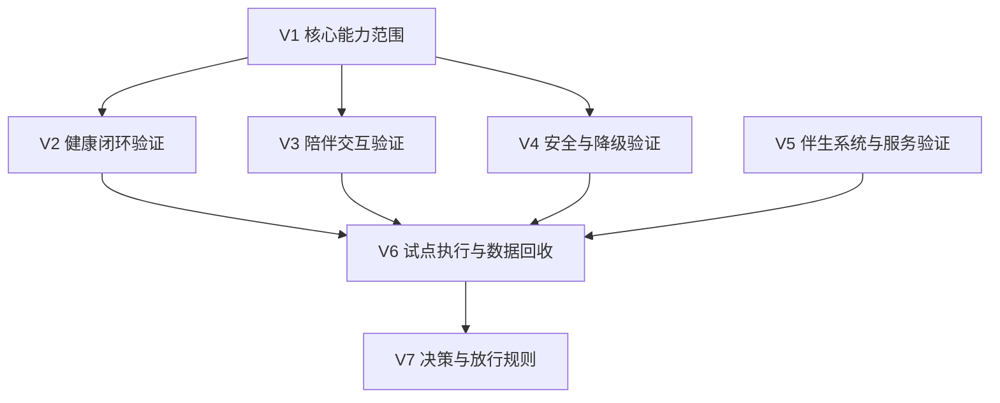

# 量产预备与MVP验证计划

## 1. 文档目的

本文档对应 `KBT-12`，用于把“`2026-12-31` 量产预备”与“`2027-01` MVP 验证窗口”连接成一份可执行验证计划。

当前要回答的不是“产品大概怎么测”，而是先固定 5 件最关键的事情：

1. 一代 `MVP` 到底验证哪些能力，不验证哪些能力
2. 哪些能力是 `必须有 / 应该有 / 可以有`
3. 健康、陪伴、安全和服务闭环各自要看什么成功信号
4. `100 台 / 100 户 / 1 个月` 级别试点应如何组织
5. 哪些结果会阻止量产主线继续推进

## 2. 当前设计前提

本版本基于以下已确认条件：

- 一代产品聚焦中国大陆居家养老场景
- 产品优先级冻结为：健康管理 > 陪伴交互 > 老人看护 > 家庭安全巡护
- `2026-12-31` 的量产预备定义已冻结为：产品定型、小批量试点可执行、随时可以开发布会
- 当前小批量试点基线仍按 `100 台 / 100 户 / 1 个月` 组织
- `KBT-16` 已定义 `G5` 量产预备门与 `7` 个判定域

## 3. 为什么 `KBT-12` 需要独立冻结

如果不单独冻结 `MVP` 验证计划，会直接导致 6 类漂移：

1. 量产预备门只有方向，没有落到真实验证动作
2. “试点”会变成展示活动，而不是系统验证
3. 各团队会对“必须验证什么”理解不一致
4. 运营、售后、App、云和本体的闭环责任会继续模糊
5. 样机成功与量产成功会被混在一起
6. `2027-01` 窗口会失去作为架构收敛回压的价值

因此，`KBT-12` 是 `KBT-16` 之后的直接落地项。

## 4. 一级验证结构

建议把 `MVP` 验证计划收敛为 `7` 个一级验证域：

## 5. `必须有 / 应该有 / 可以有` 范围

### 5.1 必须有

一代 `MVP` 建议至少验证以下能力：

1. 老人本人识别、基础语音交互、找人和到人能力
2. 睡眠监测能力，至少覆盖夜间离床、未按习惯起床和基础睡眠节律观察
3. 计划提醒、用药提醒、递送、确认、通知主链
4. 家属通知与异常升级主链
5. 久卧不起、摔倒、陌生人闯入、夜间离床等优先风险的最小闭环
6. App、云、后台人工服务的最小协同能力
7. 故障保护、降级和回退链可运行

### 5.2 应该有

1. 主动陪伴触发中的至少一部分高价值场景
2. 在线问诊转接和第三方履约的最小闭环
3. 家庭内多角色权限与记忆治理的可用版本
4. 智能家居至少一部分高价值事件接入
5. 找物能力的可用版本，限定在家庭内已知空间和常见目标物范围

### 5.3 可以有

1. 通过交互测试并辅助缓解阿尔茨海默症相关问题的专项功能
2. 外出未归相关能力
3. 美好瞬间记录和休闲娱乐功能
4. 更丰富的人设个性化
5. 更复杂的保姆协同
6. 更深的第三方生态闭环
7. `UWB` 增强线能力

## 6. 各验证域的成功信号

### 6.1 `V2` 健康闭环验证

重点验证：

- 信号采集是否稳定
- 提醒、补采、递送、确认、通知是否形成闭环
- 人工服务、问诊、第三方履约是否在需要时接得上

成功信号：

- 健康主链不是演示链，而是可重复运行链
- 数据来源、新鲜度和补采理由有据可追
- 高风险异常升级不会卡在中间状态
- 睡眠监测至少能稳定支撑“夜间离床、未按习惯起床、晨间状态确认”这类高价值场景

### 6.2 `V3` 陪伴交互验证

重点验证：

- 亲切家人型人设是否成立
- 主动交互是否在不打扰的前提下有价值
- 记忆、提醒和个性化是否真正提升依从性

成功信号：

- 老人愿意持续与机器人互动
- 主动交互不会明显造成反感或打扰
- 记忆与提醒带来可感知帮助

### 6.3 `V4` 安全与降级验证

重点验证：

- 危险事件识别是否稳定
- 定位异常、低电量、关键传感器失效等降级是否按设计执行
- 机器人在不确定状态下是否足够保守

成功信号：

- 关键自动动作不过度冒进
- 故障保护与硬停边界真实可触发
- 安全问题能形成结构化复盘

### 6.4 `V5` 伴生系统与服务验证

重点验证：

- 家属 App、云服务、后台坐席是否形成闭环
- 第三方履约、远程确认和升级链路是否能协同
- 售后、升级与问题分级是否准备到位

成功信号：

- 用户问题不会只停留在机器人本体
- 伴生系统不会反向拖垮本体验证
- 服务响应与问题升级有明确责任面

## 7. 试点执行框架

当前建议把 `100 台 / 100 户 / 1 个月` 试点拆成 4 个层次：

1. `T1` 内部陪跑样板户
说明：先验证核心链路是否可连续运行。

2. `T2` 小规模受控家庭
说明：验证部署、交付、培训、售后和问题升级。

3. `T3` 正式 MVP 试点批次
说明：按目标用户结构收集真实使用数据、异常和留存反馈。

4. `T4` 试点复盘与放行
说明：判断哪些问题会阻止量产主线继续推进，哪些进入后续版本。

## 8. 放行与阻断规则

当前建议把试点结果收敛为 3 类：

| 类别 | 含义 | 对主线影响 |
| --- | --- | --- |
| `P` 通过项 | 结果符合设计预期 | 进入下一阶段 |
| `W` 观察项 | 问题存在但不阻断当前主线 | 进入版本跟踪 |
| `B` 阻断项 | 会破坏量产预备或核心体验 | 阻止放行 |

当前判断：

- 健康主链断裂
- 安全故障无法稳定回退
- 伴生系统闭环不存在
- 高端产品感知明显失真

这些问题都应默认按 `B` 阻断项处理。

## 9. 与 `KBT-16` 的关系

`KBT-12` 与现有基线的关系建议冻结为：

1. 与 [docs/量产预备判定标准.md](docs/量产预备判定标准.md) 的关系：`KBT-16` 给出上层阶段门，本文给出验证执行框架。
2. 与 [docs/健康事件管线与升级链路.md](docs/健康事件管线与升级链路.md) 的关系：本文负责验证健康主链是否真实跑通。
3. 与 [docs/陪伴交互策略.md](docs/陪伴交互策略.md) 的关系：本文负责验证陪伴交互是否真的成立。
4. 与 [docs/安全风险矩阵.md](docs/安全风险矩阵.md) 的关系：本文负责验证优先风险域和降级策略是否有效。
5. 与 [docs/家属应用、云服务与后台运营坐席一代最小闭环.md](docs/家属应用、云服务与后台运营坐席一代最小闭环.md) 的关系：本文负责验证伴生系统闭环是否具备试点条件。

## 10. 本轮收口结论与后续问题

`KBT-12` 当前轮次已完成评审收口，新增结论如下：

1. `必须有` 范围新增睡眠监测能力，但首版目标收敛为“夜间离床、未按习惯起床和基础睡眠节律观察”，不把医疗级睡眠分期写入一代承诺。
2. `应该有` 范围新增找物能力，但首版只要求在家庭内已知空间和常见目标物范围内可用。
3. `可以有` 范围新增阿尔茨海默症相关交互测试、外出未归、美好瞬间记录和休闲娱乐功能，这些能力不进入当前量产预备阻断项。
4. `V1-V7`、`100 台 / 100 户 / 1 个月` 四层试点框架，以及 `P / W / B` 放行规则保持有效。

后续继续收敛的问题建议保留为：

1. 睡眠监测在一代应量化到哪些日级和夜级指标。
2. 找物能力的一代目标物清单、成功率目标和失败回退方式。
3. `P / W / B` 是否要进一步量化到执行阈值和复盘模板。
